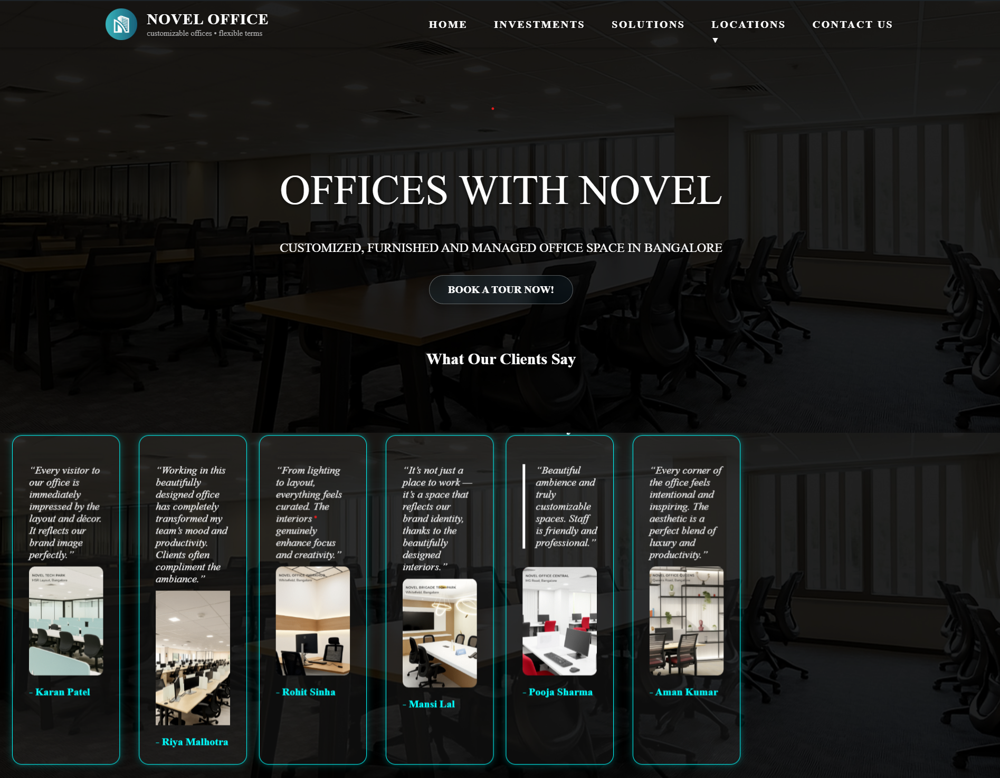
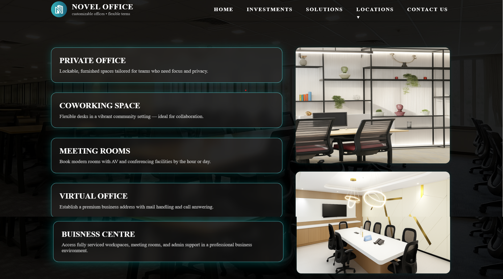
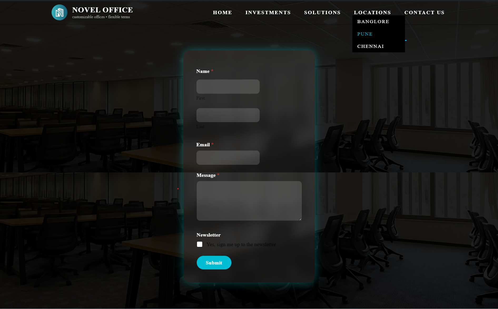

# Novel Spaces – Custom WordPress Theme

This is a custom WordPress theme developed for showcasing flexible and managed office spaces. Built using PHP, HTML, CSS, and JavaScript — fully integrated with WordPress CMS.

## ✅ Features

- Custom Homepage (front-page.php)
- Responsive navigation with dropdown (JavaScript-based)
- Custom Post Type: Testimonials
- Testimonial auto-slider (left text + right image)
- Contact Form with custom CSS (via WPForms or manual handler)
- Solutions page with card + image layout
- Theme options via WordPress admin
- Fully responsive and SEO-ready design
- Performance optimization (lazy loading, compressed images)

---
## 🔧 Installation Steps

1. Download or clone the repository:
   ```bash
   git clone https://github.com/amanazad9386/novel-spaces.git# Novel Spaces – Custom WordPress Theme

##  Installation & Testing

1. Clone the repo or download the ZIP.
2. Copy the folder to `wp-content/themes/` in your local WordPress setup.
3. Activate the theme from Appearance > Themes.
4. Import `sample-data.xml` (optional) if provided.
5. Add 3–4 testimonials from WP Admin > Testimonials.
6. Visit homepage to see animations and custom features.

### Homepage


### Solution Page


### Contact Form

